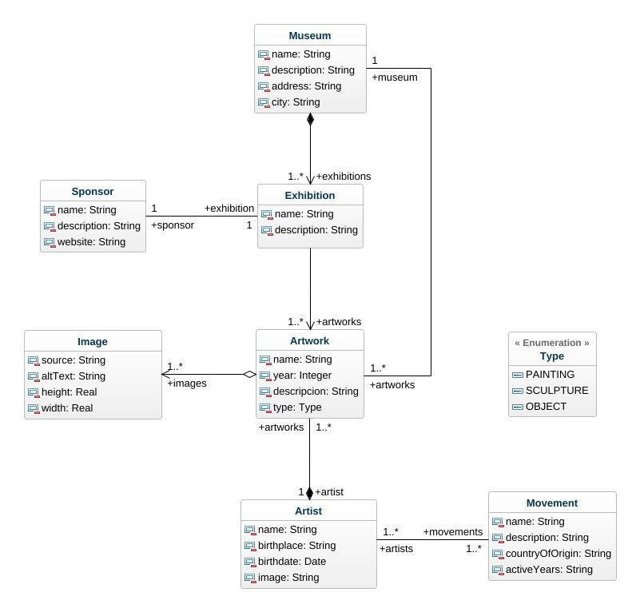

## Generalidades del proyecto

Este curso gira alrededor de un proyecto de desarrollo de software. Se espera que los estudiantes adquieran conocimientos y desarrollen habilidades mientras avanzan en él.

El proyecto se hace en equipos de 3 - 4 estudiantes. El producto que se debe construir está conformado por una aplicación web que se integra con un _Back-end_ existente mediante una interface de servicios. La aplicación se espera que sea semejante a muchas existentes y utilizadas de manera regular por miles de personas en el mundo.

Los retos a los que el grupo se enfrenta son similares a los que debe abordar un grupo de desarrollo en el mundo real.

Los estudiantes tendrán que rendir cuentas tanto por su trabajo individual como por su contribución, colaboración y soporte en el equipo. El éxito de cada estudiante depende de la terminación exitosa del producto y en la evidencia del buen funcionamiento del equipo.

Cada semana el estudiante debe realizar actividades de manera autónoma para las que se dispone de un conjunto de recursos en línea que le permitirán avanzar en ellas. Durante la sesión síncrona se aclararán dudas y se trabajará en cómo los conceptos se incorporan en el proyecto. El equipo trabajará en el seguimiento y planeación del proyecto y el profesor dará retroalimentación sobre los avances.

## Enunciado del proyecto

| Nota                                                                                                                   |
| ---------------------------------------------------------------------------------------------------------------------- |
| Este es el enunciado general del proyecto. En este curso realizaremos un subconjunto de las funcionalidades propuestas |

Un grupo de entusiastas del arte moderno quieren desarrollar una aplicación web que permita conocer los museos de arte moderno del mundo, sus exhibiciones, las obras, los artistas y sus estilos o movimientos pictóricos (impresionismo, cubismo, dadaísmo, etc.).

Por cada museo sabemos su nombre, imagen, descripción, dirección, ciudad y salas de exhibiciones. A partir de una lista de museos podemos ingreasar a cada uno de ellos y navegar las salas con las obras exhibidas. Cada sala tiene un nombre, una descripción, un patrocinador y un conjunto de obras en exhibición.

Una obra tiene un nombre, un tipo (pintura, escultura, objeto), el artista, el año de elaboración y un conjunto de imágenes.

A partir de la obra se debe poder navegar por el artista. De cada artista se conocen su nombre, una imagen, lugar y fecha de nacimiento, los movimientos artísticos a los que perteneció. Si se navega por el artista se debe ver una galería de sus obras.

## Modelo conceptual

| Concepto     | Descripción                                                |
| ------------ | ---------------------------------------------------------- |
| Museum       | Lugar en que se conservan y exponen colecciones de objetos |
| Exhibition   | Sala de exhibición que contiene un conjunto de obras       |
| Sponsor      | Patrocinador de una exhibición                             |
| Artwork      | Obra artística                                             |
| Image        | Imagen que representa una obra                             |
| Artist       | Persona que crea una obra artística                        |
| Movement     | Movimiento artístico                                       |
| MovementType | Enumeración para nombrar los movimientos artísticos        |

## Infraestructura

Para el desarrollo del proyecto se cuenta con la siguiente infraestructura:

### API REST

Los servicios que usará el front son provistos por un API REST que está previamente desarrollado. Las herramientas en las cuales está construido son:

| Elemento                 | Herramienta                                   |
| ------------------------ | --------------------------------------------- |
| Base de datos            | Postgres                                      |
| Framework                | Nest.js                                       |
| Lenguaje de programación | Typescript                                    |
| Repositorio              | https://github.com/MISW-4104-Web/BackMuseums/ |

El proyecto está configurado para que pueda ser desplegado en Heroku facilmente. Para el despliegue siga las instrucciones de este documento:

- [Tutorial despliegue back en Heroku](https://misovirtual.virtual.uniandes.edu.co/codelabs/DespliegueHeroku/index.html#1)

#### Documentación del API

- [Artist]()
- [Artist Movement]()
- [Artwork]()
- [Exhibition]()
- [Exhibition Artwork]()
- [Image]()
- [Movement]()
- [Movement Artist]()
- [Museum]()
- [Sponsor]()

### Front

El front será desarrollado usando el framework Angular. El lenguaje de programación será Typescript y se usarán otras herramientas que se intregan en Angular como Bootstrap y Toastr.

## Distribución del trabajo por semanas

El proyecto está dividido en 8 semanas de trabajo. Para realizar la planeación y el seguimiento, la semana de trabajo se toma desde el lunes a las 0:00 horas hasta el domingo a las 23:59 horas. Por tanto, todos los entregables de cada actividad deberán estar disponibles antes de la hora de cierre en la wiki o en el repositorio del proyecto según corresponda.
