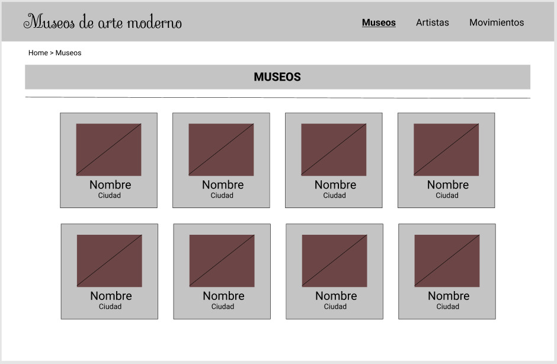

# Detalle de la historia de usuario

## HU01: Consultar catálogo de álbumes

| Elemento                        | Descripción                                                                                                                                                                                                                                                 |
| ------------------------------- | ----------------------------------------------------------------------------------------------------------------------------------------------------------------------------------------------------------------------------------------------------------- |
| Consultar el listado de museos  | Como usuario visitante quiero navegar el catálogo de los álbumes para escoger los que más me interesan                                                                                                                                                      |
| Criterios de aceptación         | Al ingresar a la aplicación web el usuario visitante debe encontrar la sección de museos en la cual se muestra un listado de todos los museos. Cada ítem (tarjeta) deberá mostrar la fotografía del museo, su nombre y la ciudad donde se encuentra ubicado |
|                                 | La interfaz gráfica de la página debe adaptarse al tamaño de la pantalla del dispositivo                                                                                                                                                                    |
| Prototipo del listado de museos |                                                                                                                                                                                        |

## Revisión HU01: Consultar catálogo de álbumes

| Criterio        | Revisión                                                                                                                                |
| --------------- | --------------------------------------------------------------------------------------------------------------------------------------- |
| `Independiente` | La HU es independiente se centra en el listado de museos; por tanto no se necesita tener implementada otra HU.                          |
| `Negociable`    | En la HU se puede negociar cómo se presentará la información                                                                            |
| `Valiosa`       | La HU es la más importante de la aplicación dado que el objetivo es enseñar a los usuarios los museos de arte moderno.                  |
| `Estimable`     | La HU puede que sea la que tome más tiempo ya que es la más importante, sin embargo, puede ser desarrollada en el marco de una semana.  |
| `Pequeña`       | La HU está acotada para que sea desarrollada a su totalidad sin afectar a las demás HUs que pueden tomar menos tiempo en desarrollarse. |
| `Testeable`     | La HU se puede probar fácilmente a partir de datos de museos y comprobar su respectivo despliegue.                                      |

Tenga en cuenta que este es un ejemplo básico para detallar una historia de usuario, no obstante se espera que sus formatos y prototipos sean más elaborados.
