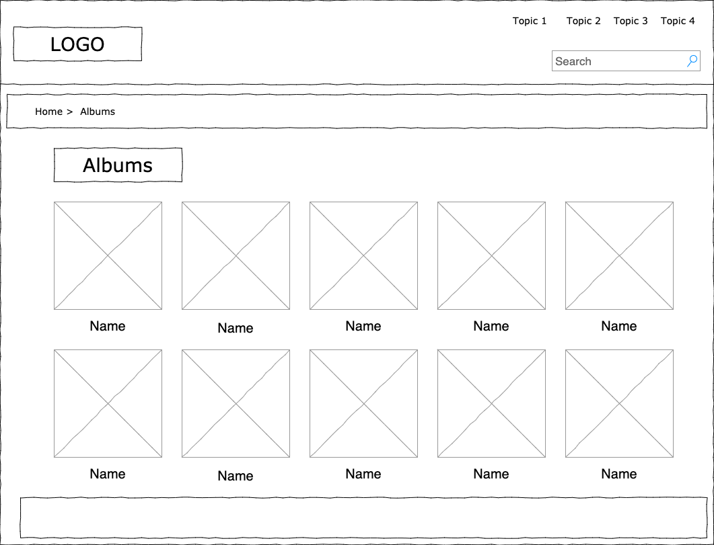

# HU01: Consultar catálogo de álbumes

| Nombre                        | Descripción                                                                                                                                      |
| ----------------------------- | ------------------------------------------------------------------------------------------------------------------------------------------------ |
| Consultar catálogo de álbumes | Como usuario visitante quiero navegar el catálogo de los álbumes para escoger los que más me interesan                                           |
| Criterios de aceptación       | Si no hay álbumes registrados, se debe mostrar una imagen indicando que el catálogo está vacío e invitando al usuario a registrar un nuevo álbum |
| Prototipo                     |                                                                                                      |
| Revisión                      |                                                                                                                                                  |

Tenga en cuenta que este es un ejemplo básico para detallar una historia de usuario, no obstante se espera que sus formatos y prototipos sean más elaborados.
